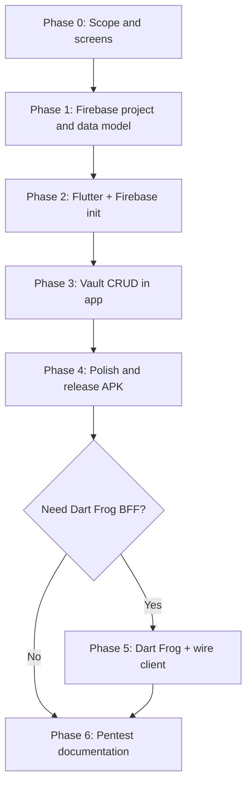

Final Project: Obtaining Higher-level Access

## Tech stack

- **Mobile app:** Flutter
- **Backend / data:** Firebase (Firestore for vault entries; Firebase Auth kept **simple**—e.g. email/password or anonymous auth only if you need a `uid`)
- **Firestore rules & Auth (lab scope):** **Intentionally minimal, not production-grade.** Use short, easy-to-read rules (e.g. broad `read`/`write` for the demo collection, or a single weak check). Do **not** build complex RLS-style logic—this app is a **deliberately vulnerable** coursework target for a **zero-hour-style** exploit narrative (**authorized lab / demo only**; never deploy this pattern to real users).
- **API layer (optional):** Dart Frog if you expose HTTP routes in front of Firebase; otherwise the Flutter app may use the Firebase SDK directly

Make a documentation of your Penetration Testing Activity :

1. Reconnaissance: discuss the scope of the penetration test, defining goals, and gathering information about the target system or network.  

2. Scanning: discuss the tools and techniques used to scan the target system or network for vulnerabilities. This includes port scanning, 
vulnerability scanning, and enumeration to identify potential weaknesses that could be exploited.

3. Gaining Access: discuss the social engineering tactics, or other methods to bypass security controls and gain a foothold within the system.

4. Maintaining Access: discuss how the ethical hacker maintain persistence within the target environment. This may involve escalating privileges, 
installing backdoors, or creating additional user accounts to ensure continued access to the system.

Scene,Action
Scene 1,Dev builds and uploads app genuinely (Flutter app configured with Firebase project; simple Auth and permissive Firestore rules for the vulnerable demo)
Scene 2,Mark and Lisa install and store passwords in the app; data syncs to Firestore under their accounts
Scene 3,Hacker reverse engineers the APK and recovers Firebase project identifiers API surface (e.g. from embedded config) and/or infers how the app talks to Firestore or HTTP endpoints
Scene 4,Hacker issues requests (e.g. Firestore REST/SDK-style calls or misused rules) without a valid user password or session and retrieves sensitive data
Scene 5,Dev has no idea; no patch exists yet (misconfiguration or design issue in Firebase rules or client trust model)

---

## Setup (before Phase 0)

Do these once so Phase 0–1 are not blocked by tooling or accounts.

| Step | What to do | Why it matters |
|------|------------|----------------|
| **Machine & OS** | Use a clean dev machine (or VM) you control; note Windows path length issues if the project lives under deep OneDrive folders—short paths reduce Flutter/Android oddities. | Fewer build failures before first run. |
| **Flutter SDK** | Install stable Flutter; run `flutter doctor` and fix **all** items needed for **Android** (SDK, licenses, at least one emulator or a physical device with USB debugging). | Confirms you can build an APK before Firebase wiring. |
| **IDE / plugins** | **VS Code or Cursor** (or another Flutter-supported editor) with the **Flutter** and **Dart** extensions. **Do not rely on Android Studio to build or open the app**—use `flutter run` / `flutter build apk` from the terminal or your editor. Android Studio remains optional **only** for installing the Android SDK, SDK Manager, or AVDs if you prefer its UI. | One consistent editor + CLI workflow for the whole project. |
| **Android package identity** | **Locked:** Android `applicationId` / Kotlin namespace **`com.cbs.cbsvault`** (Dart package name **`cbsvault`**). Do **not** change without updating Firebase app registration and signing. | Firebase Android app and release signing are tied to this id. |
| **Firebase & Google** | **Manual (browser):** Use a **Google account** you are allowed to use for this course; sign in to [Firebase Console](https://console.firebase.google.com). Prefer **Spark (free)**; use **Blaze** only if the course requires a paid capability. Follow the checklist below—creating the Firebase **project** and registering Android (`com.cbs.cbsvault`) is **Phase 1**, not this row. | Console access + billing stance before you wire the app in Phase 1–2. |
| **Git / backup** | **Done locally:** `git init` in this folder; initial commit on `master`. Root `.gitignore` ignores **`android/app/google-services.json`**, **`ios/Runner/GoogleService-Info.plist`**, and Android signing (`key.properties`, `*.jks`, `*.keystore`). Tracked placeholder: `android/app/google-services.json.example`. Push to a course-approved remote when you have one. | Recoverable history; real Firebase config stays untracked by default. |
| **Lab scope & ethics** | **See paragraph below** (authorized scope, fake data only, who may run the APK; instructor rules apply). | Keeps the “vulnerable app” story inside coursework boundaries. |
| **Test device** | At least one **physical Android phone** *or* a reliable AVD for install and Scene 2–4 testing. | Pentest narrative needs a real install path. |
| **Optional: Dart Frog** | If you will use it: install Dart SDK and `dart_frog` CLI; confirm `dart --version` matches Flutter’s Dart or use the docs for your version. | Only needed before Phase 5 if that phase is in scope. |
| **Optional: HTTP proxy** | If your course allows **traffic capture** (Burp/mitmproxy): plan Android cert install / emulator proxy **before** you rely on it in the report. | Scanning section needs tools you can actually run. |

### Lab scope & ethics

This work runs **only** in an **authorized** course or lab environment, under rules set by the **instructor** (and any institution policy on security assignments). All data entered into the app or Firebase for the demo—including anything labeled as “passwords”—must be **fabricated or obviously non-sensitive**; **do not** store real user credentials, production secrets, or personal information. The intentionally permissive Firebase setup exists **solely** to support the coursework narrative and must **not** be reused for real users or public deployment. The **APK** may be built, installed, and used **only** by **course participants**, the **instructor**, and **designated reviewers** (e.g. teammates), on **test phones, emulators, or lab machines** dedicated to this project. Penetration-testing activities described in the report must stay within that scope; if the instructor specifies different boundaries or data-handling requirements, those take precedence.

### Firebase & Google (manual checklist)

Complete these in a browser (the editor cannot authenticate for you):

1. **Account** — Use or create a Google account permitted for this coursework.
2. **Console** — Sign in at [Firebase Console](https://console.firebase.google.com); confirm you can open the dashboard without errors.
3. **Billing** — For any new Firebase project, stay on **Spark** unless the syllabus requires **Blaze** (e.g. some Cloud Functions or quota scenarios). Firestore + **simple** Auth are available on Spark for development and small demos.
4. **Later (Phase 1)** — Add a Firebase project, register the Android app with package **`com.cbs.cbsvault`**, download `google-services.json`, enable Firestore and minimal Auth, and set permissive rules per your lab brief.

**Order of operations:** install Flutter → fix `flutter doctor` for Android → **Firebase & Google checklist above** → **then** start **Phase 0** (scope). Do **not** spend time on Firestore rules design until the machine can build and run a blank Flutter app on a device/emulator.

---

## Development roadmap

Use this order so Firebase, the app shell, and your pentest story stay aligned.

### Phases

| Phase | Goal | Outcomes |
|--------|------|----------|
| **0 — Scope** | Lock assumptions for the demo | List screens (splash, auth or unlock, vault list, add/edit, settings), Firestore collections/fields, simplest Auth option (or none + open rules—only in lab), release target (Android APK for lab) |
| **1 — Firebase project** | Backend ready before UI depth | **Done — see “Phase 1 — Firebase” below.** Project `cbsvault-lab-cbs`; Android `com.cbs.cbsvault`; Firestore + permissive `entries` rules deployed; packages wired; **enable sign-in methods in Console** (Email/Password or Anonymous) before auth UI. |
| **2 — Flutter foundation** | Runnable app wired to Firebase | **Done — see “Phase 2 — Flutter foundation” below.** `go_router` + dark Inter theme; all shell screens; **email/password** + **Google** sign-in; loading + `SnackBar` errors; Firestore CRUD still Phase 3. |
| **3 — Vault vertical slice** | End-to-end value | **Done — see “Phase 3 — Vault” below.** Full CRUD on `entries` for the signed-in user; list + detail + add/edit + delete + copy; **no** local master-password UI. |
| **4 — Polish & packaging** | Looks like a real app | Empty states, validation, copy actions, version string in Settings; **release** build; install on devices for Mark/Lisa scenario |
| **5 — Optional Dart Frog** | Only if you chose BFF | Dart Frog service deployed or local; Flutter calls your HTTP layer instead of/in addition to SDK; document base URLs |
| **6 — Pentest alignment** | Report matches the build | Capture screenshots, note APK analysis steps, document discovered identifiers/endpoints and rule weaknesses; map to Recon → Scanning → Access → Maintain |

### Phase 1 — Firebase (implemented)

- **Firebase project:** `cbsvault-lab-cbs` (display name **CBS Vault Lab**). Console: [Firebase project](https://console.firebase.google.com/project/cbsvault-lab-cbs/overview).
- **Android app:** package **`com.cbs.cbsvault`** registered; `android/app/google-services.json` is present locally (**gitignored**). On a new clone, run `flutterfire configure --project=cbsvault-lab-cbs` (or download the config from the Console).
- **Flutter packages:** `firebase_core`, `firebase_auth`, `cloud_firestore`. Options: `lib/firebase_options.dart` (FlutterFire). `main.dart` calls `Firebase.initializeApp` before `runApp`.
- **Firestore:** Native database created; **rules** live in `firestore.rules` (lab-only: open read/write on collection **`entries`** only). Deploy: `firebase deploy --only firestore:rules` (uses `firebase.json` + `.firebaserc`).
- **Flat data model:** collection **`entries`** — fields `siteUrl`, `username`, `secret`, `notes`, `createdAt`, `ownerUid` (see **Phase 3 — Vault**).
- **Auth (Console step):** In **Authentication → Sign-in method**, enable at least one of **Email/Password** or **Anonymous** before you exercise sign-in from the app (APIs are enabled; providers are toggled in the Console).

### Phase 0 — Scope (locked)

- **Screens / routes:** **Splash** → **Login** (unlock / demo) → **Vault home** (search + list) → **Entry detail** (copy / edit / delete) → **Add/Edit entry** (site/URL, username, password, optional notes) → **Settings** (placeholder “Server/API”, About demo-only, version).
- **Release target:** Android APK (lab), as before.

### Phase 2 — Navigation & UI (design reference)

- **Routing:** **`go_router`** — predictable back-stack across Splash → Login → Vault → detail / add-edit / settings.
- **Visual direction:** **Dark mode primary**; **teal accent**; corporate-educational tone; **Inter** via `google_fonts`.
- **Splash / Login / Vault / Entry / Settings:** See **Phase 0 — Scope** and original UI brief for copy and layout goals.

### Phase 2 — Flutter foundation (implemented)

- **Packages:** `go_router`, `google_fonts`, `package_info_plus` (version in Settings).
- **Theme:** `lib/theme/app_theme.dart` — dark `ColorScheme`, teal primary, `GoogleFonts.interTextTheme`.
- **Router:** `lib/router/app_router.dart` — auth redirect (signed-in users skip `/login`); `GoRouterRefreshStream` on `FirebaseAuth.instance.authStateChanges()`.
- **Routes:** `/splash` → `/login` → `/vault`; `/settings`; `/entry/new`; `/entry/:entryId`; `/entry/:entryId/edit`.
- **Screens:** `lib/screens/` — `SplashScreen`, `LoginScreen` (**Email/Password**, **Google**, **Create account**), `VaultHomeScreen` (Firestore-backed list + search), `EntryDetailScreen` / `EntryEditScreen`, `SettingsScreen` (placeholder server URL, About, **Sign out**).
- **Feedback:** `SnackBar` via `lib/widgets/app_snackbar.dart`; button loading states on login / save.

### Phase 3 — Vault (implemented)

- **Repository / model:** `lib/data/entries_repository.dart`, `lib/models/vault_entry.dart` — queries `entries` where `ownerUid` matches the current Firebase user; sort by `createdAt` in app (newest first).
- **Create:** FAB or `/entry/new` → **Save** writes a new document with `FieldValue.serverTimestamp()` for `createdAt`.
- **Read:** Vault list (live stream); detail screen streams a single document by id.
- **Update:** Edit route loads existing fields; **Save** calls `update`.
- **Delete:** Detail app bar → confirm dialog → `delete` → navigate to `/vault`.
- **Copy:** Username and password on detail use the system clipboard (`Clipboard`).
- **Search:** Client-side filter on `siteUrl`, `username`, `notes`.
- **Not implemented:** Local “master password” / extra unlock layer (skipped per scope).

### Flow (high level)

### Dependency note

Decide **basic** Auth (sign-in vs anonymous vs none) and **one** Firestore rules file in **Phase 1** so the Flutter client matches—but keep both **simple** on purpose; you are not iterating toward “secure,” you are documenting a **weak** baseline for the lab. The optional Dart Frog layer should be introduced only after the **vertical slice** works with Firebase directly, unless your architecture depends on it from day one.

### After the lab (report)

Briefly contrast the demo with **least privilege**: tight Firestore rules, Auth-required reads/writes, and secrets not recoverable from the APK—so your report shows you understand **mitigation**, not just exploitation.
